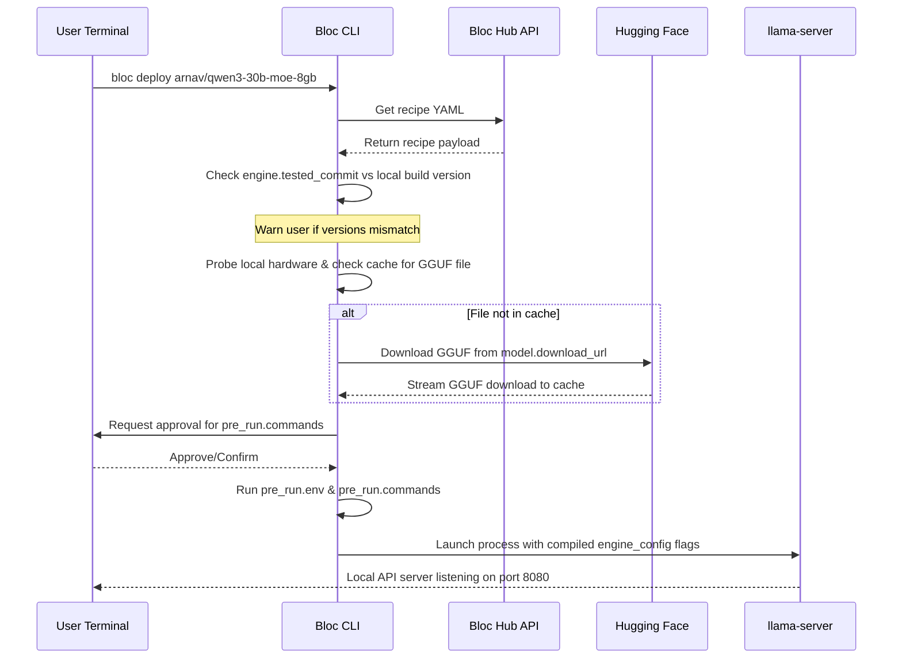

Bloc is designed as a version-agnostic, local-first orchestrator for local AI model deployments. It doesn't fight the rapid velocity of upstream engines like `llama.cpp` — instead, it decouples metadata indexing from execution logic.

---

## The Sealed Envelope Pattern

A recipe is a YAML document split into two distinct responsibility layers:

```
┌─────────────────────────────────────────────────────────┐
│                    BLOC RECIPE (.yaml)                  │
├─────────────────────────────────────────────────────────┤
│ LAYER 1: Registry Metadata                              │
│ (Parsed & indexed by the Hub website)                   │
│ - name, tags, base_model, min_vram, target_platform     │
├─────────────────────────────────────────────────────────┤
│ LAYER 2: Engine Configuration                           │
│ (Opaque payload, executed verbatim by the CLI)           │
│ - engine_config (ctx_size, gpu_layers, etc.)            │
│ - pre_run hooks (env vars, shell commands)              │
└─────────────────────────────────────────────────────────┘
```

### Layer 1: Registry Metadata
This layer contains structured fields that the **Bloc Hub** parses and indexes. It powers the Hub search engine, tags, stars, and hardware compatibility filters (like VRAM requirements or target operating systems).

### Layer 2: Engine Configuration
This layer is treated as an opaque configuration payload by the Hub backend. The Hub stores it verbatim without attempting to validate or run it. 

When you run `bloc deploy`, the **Bloc CLI** opens this "envelope", reads the config parameters, translates them directly into executable CLI arguments (e.g. `llama-server` flags), and launches the engine process.

> [!TIP]
> This decoupling means new `llama.cpp` features or command flags can be adopted immediately by recipe authors via `extra_args` without needing any backend updates on the Bloc Hub.

---

## The Deployment Lifecycle

When a user runs a command like `bloc deploy arnav/qwen3-30b-moe-8gb`, the following sequence executes locally:



1. **Fetch**: The CLI retrieves the recipe YAML from the Hub API.
2. **Version Match**: The CLI compares `engine.tested_commit` against the version output from your local `llama-server --version`. If they mismatch, it prints a warning, giving you the choice to proceed.
3. **Download**: The CLI checks your local cache directory for the exact `model.file`. If not found, it downloads it directly from `model.download_url` and verifies its size.
4. **Pre-Run Execution**: The CLI prompts you to confirm any pre-run scripts (such as GPU power capping commands) and sets environment variables.
5. **Launch**: The CLI compiles the structured `engine_config` fields and `extra_args` into CLI arguments, launching `llama-server` as a sub-process.

---

## Telemetry & Compatibility Loop

Upstream inference tools release dozens of updates daily. To guarantee compatibility without manual maintenance, Bloc uses an automated **Telemetry Feedback Loop**:

1. **Run Completion**: After a deployment runs successfully or encounters an exit failure, the CLI posts a lightweight, anonymous summary back to the Hub:
   ```json
   {
     "recipe_id": "arnav/qwen3-30b-moe-8gb",
     "llama_build": "b5420",
     "success": true,
     "tokens_per_sec": 44
   }
   ```
2. **Crowdsourced Compatibility**: The Hub parses these summaries to compile `compat_builds` for the recipe. This list is displayed directly on the Hub recipe card so other users can see which engine commits are verified to work.
3. **Privacy by Design**: Telemetry never includes prompt text, outputs, file paths, hostnames, or IP addresses. It can be permanently disabled via `bloc telemetry off` or by setting the `BLOC_NO_TELEMETRY=1` environment variable.
