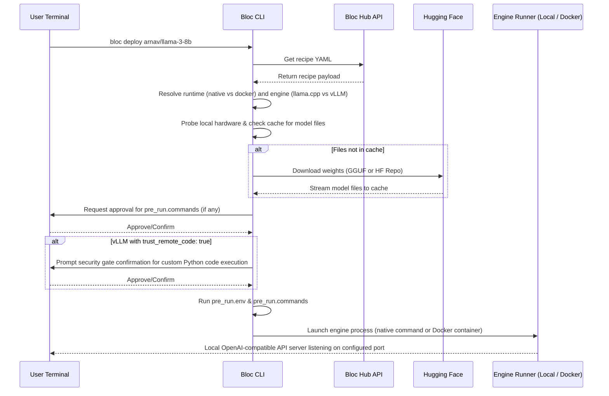

Bloc is designed as a version-agnostic, local-first orchestrator for local AI model deployments. It doesn't fight the rapid velocity of upstream engines like `llama.cpp` or `vLLM` — instead, it decouples metadata indexing from execution logic.

---

## The Sealed Envelope Pattern

A recipe is a YAML document split into two distinct responsibility layers:

```
┌─────────────────────────────────────────────────────────┐
│                    BLOC RECIPE (.yaml)                  │
├─────────────────────────────────────────────────────────┤
│ LAYER 1: Registry Metadata                              │
│ (Parsed & indexed by the Hub website)                   │
│ - name, tags, base_model, min_vram, target_platform     │
│ - engine.name, engine.runtime, model.hf_repo            │
├─────────────────────────────────────────────────────────┤
│ LAYER 2: Engine Configuration                           │
│ (Opaque payload, executed verbatim by the CLI)           │
│ - engine_config (ctx_size, tensor_parallel_size, etc.)  │
│ - pre_run hooks (env vars, shell commands)              │
└─────────────────────────────────────────────────────────┘
```

### Layer 1: Registry Metadata
This layer contains structured fields that the **Bloc Hub** parses and indexes. It powers the Hub search engine, tags, stars, and hardware compatibility filters (like VRAM requirements, target platforms, engine names, and runtimes).

### Layer 2: Engine Configuration
This layer is treated as an opaque configuration payload by the Hub backend. The Hub stores it verbatim without attempting to validate or run it. 

When you run `bloc deploy`, the **Bloc CLI** opens this "envelope", resolves the engine and runtime parameters, validates the configuration, downloads the weights, and boots up the model engine.

---

## The Deployment Lifecycle

When a user runs a command like `bloc deploy arnav/llama-3-8b`, the following sequence executes locally:



1. **Fetch**: The CLI retrieves the recipe YAML from the Hub API.
2. **Resolve Runtime & Engine**: The CLI determines the designated engine (`llama.cpp` or `vllm`) and runtime (`native` or `docker`).
3. **Download**: The CLI checks your local cache directory (`~/.cache/bloc/models` or `~/.cache/bloc/repos`). If the weights are missing, it downloads either the single GGUF file or the entire Hugging Face repository (safetensors, configurations, tokenizers) using your local credentials.
4. **Pre-Run & Safety Gates**: 
   * The CLI prompts you to confirm any pre-run scripts.
   * If the model uses vLLM and requires custom python code execution (`trust_remote_code: true`), the CLI forces a security prompt gate requiring explicit confirmation.
5. **Launch**: The CLI compiles the structured parameters into the designated engine flags and launches the server. If `runtime: docker` is configured, it automatically pulls the image, configures GPU passthrough (via NVIDIA Container Toolkit), mounts cache directories, and runs the container.

---

## Telemetry & Compatibility Loop

Upstream inference tools release updates daily. To guarantee compatibility without manual maintenance, Bloc uses an automated **Telemetry Feedback Loop**:

1. **Run Completion**: After a deployment runs successfully or encounters an exit failure, the CLI posts a lightweight, anonymous summary back to the Hub:
   ```json
   {
     "recipe_id": "arnav/llama-3-8b",
     "engine": "vllm",
     "runtime": "docker",
     "success": true,
     "tokens_per_sec": 78.4
   }
   ```
2. **Crowdsourced Compatibility**: The Hub parses these summaries to compile compatibility stats for the recipe. This is displayed directly on the Hub recipe card so other users can verify which environments are working.
3. **Privacy by Design**: Telemetry never includes prompt text, outputs, file paths, hostnames, or IP addresses. It can be permanently disabled via `bloc telemetry off` or by setting the `BLOC_NO_TELEMETRY=1` environment variable.
